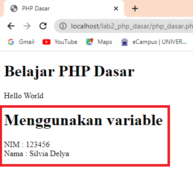

# Pratikum 2 - PHP Dasar

## Latihan 1

* Membuat folder baru dengan nama **lab2_php_dasar** pada root directory web server (htdocs)  
* Untuk mengakses directory tersebut pada web server dengan mengakses URL : http://localhost/lab2_php_dasar/
* Buat file baru dengan nama **php_dasar.php** pada folder **lab2_php_dasar** 
* Kemudian ketikan kode berikut ini di dalam file php_dasar.php :

```html
    <!DOCTYPE html> 
    <html lang="en"> 
    <head> 
        <meta charset="UTF-8"> 
        <title>PHP Dasar</title> 
    </head> 
    <body> 
        <h1>Belajar PHP Dasar</h1> 
        <?php 
            echo "Hello World"; 
        ?> 
    </body> 
    </html>
```

* Hasilnya akan seperti berikut ini :


### Variable PHP

Menambahkan variable pada program. Biasanya diawali dengan ;
* Karakter **$**
* Nama variable bisa terdiri dari karakter huruf, angka, dan underscore
* Setelah karakter **$**, harus diikuti karakter huruf atau underscore
* Case sensitive.

1. Ketikan kode berikut ini :

```html
    <?php 
    $nim = "123456"; 
    $nama = 'Silvia Delya'; 
    echo "NIM : " . $nim . "<br>"; 
    echo "Nama : $nama"; 
    ?>
```

2. Outputnya akan seperti berikut :



### Predefine Variable $_GET

Merupakan variable yang dihasilkan oleh query string URL atau melalui http get.

1. Ketikan kode berikut ini :

```html
    <?php 
    echo 'Selamat Datang ' . $_GET['nama']; 
    ?>
```

* Untuk mengaksesnya gunakan URL : http://localhost/lab2_php_dasar/latihan2.php?nama=Silvia 

* Untuk nama file menyesuaikan. 

2. Outputnya akan seperti berikut :


### Membuat Form Input

1. Ketikan kode berikut ini :

```html
    <!DOCTYPE html> 
    <html lang="en"> 
    <head> 
        <meta charset="UTF-8"> 
        <title>PHP Dasar</title> 
    </head> 
    <body> 
    <h2>Form Input</h2> 
    <form method="post"> 
        <label>Nama: </label> 
        <input type="text" name="nama"> 
        <input type="submit" value="Kirim"> 
    </form> 
    <?php 
    echo 'Selamat Datang ' . $_POST['nama']; 
    ?> 
    </body> 
    </html>
```

2. Outputnya akan seperti berikut :


### Operator

1. Ketikan kode berikut ini :

```html
    <?php 
    $gaji = 1000000; 
    $pajak = 0.1; 
    $thp = $gaji - ($gaji*$pajak); 
    echo "Gaji sebelum pajak = Rp. $gaji <br>"; 
    echo "Gaji yang dibawa pulang = Rp. $thp"; 
    ?>
```

2. Outputnya akan seperti berikut :


### Kondisi If Else ElseIf

Struktur If, Else, ElseIf adalah percabangan logika lanjutan dari If. Dengan If, Else, ElseIf, kita bisa membuat kode program untuk menyeleksi berbagai kemungkinan.

1. Ketikan kode berikut ini :

```html
    <?php 
    $nama_hari = date("l"); 
    if ($nama_hari == "Sunday") { 
        echo "Minggu"; 
    } elseif ($nama_hari == "Monday") { 
        echo "Senin"; 
    } else { 
        echo "Selasa"; } 
    ?>
```

2. Outputnya akan seperti berikut :


### Kondisi Switch

Struktur switch case adalah percabangan kode program dimana kita membandingkan isi sebuah variabel dengan beberapa nilai. Jika proses perbandingan tersebut menghasilkan true, maka block kode program akan di proses.

1. Ketikan kode berikut ini :

```html
    <?php 
    $nama_hari = date("l"); 
    switch ($nama_hari) { 
        case "Sunday": 
            echo "Minggu"; 
            break; 
        case "Monday": 
            echo "Senin";
            break; 
        case "Tuesday": 
            echo "Selasa"; 
            break; 
        default: 
            echo "Sabtu"; 
    ?> 
```

2. Outputnya akan seperti berikut :


### Perulangan For

Struktur perulangan for adalah instruksi program yang bertujuan untuk mengulang beberapa baris perintah.

1. Ketikan kode berikut ini :

```html
    <?php 
    echo "Perulangan 1 sampai 10 <br />"; 
    for ($i=1; $i<=10; $i++) { 
        echo "Perulangan ke: " . $i . '<br />'; 
    } 
    
    echo "Perulangan Menurun dari 10 ke 1 <br />"; 
    for ($i=10; $i>=1; $i--) { 
        echo "Perulangan ke: " . $i . '<br />'; 
    } 
    ?>
```

2. Outputnya akan seperti berikut :


### Perulangan While

Perulangan while digunakan untuk kondisi dimana banyaknya perulangan yang tidak dapat dipastikan saat penulisan kode program.

1. Ketikan kode berikut ini :

```html
    <?php 
    echo "Perulangan 1 sampai 10 <br />"; 
    $i=1; 
    while ($i<=10) { 
        echo "Perulangan ke: " . $i . '<br />'; 
        $i++; 
    } 
    ?>
```

2. Outputnya akan seperti berikut :


### Perulangan Do While

Perulangan while dan do-while pada dasarnya hampir sama. Perbedaannya terletak pada lokasi pemeriksaan kondisi perulangan. 
* Dalam struktur while, pemeriksaan kondisi di lakukan di awal, sehingga jika kondisi tidak terpenuhi, maka perulangan tidak akan pernah dijalankan.
* Namun pada perulangan do while, pemeriksaan kondisi akan dilakukan di akhir, sehingga walaupun kondisi yang diperiksa false, perulangan akan tetap berjalan minimal 1 kali.

1. Ketikan kode berikut ini :

```html
    <?php 
    echo "Perulangan 1 sampai 10 <br />"; 
    $i=1; 
    do { 
        echo "Perulangan ke: " . $i . '<br />'; 
        $i++; 
    } while ($i<=10); 
    ?>
```

2. Outputnya akan seperti berikut :


## Latihan 2

Buatlah program PHP sederhana dengan menggunakan form input yang menampilkan nama, tanggal lahir dan pekerjaan. Kemudian tampilkan outputnya dengan menghitung umur berdasarkan inputan tanggal lahir. Dan pilihan pekerjaan dengan gaji yang berbeda-beda sesuai pilihan pekerjaan.

1. Buat file baru dengan nama **index.php** dan **tampil.php**, file **index.php** digunakan sebagai tampilan utama ketika program dijalankan.

2. Kode program **index.php** :

```html
    <!DOCTYPE html>
<html lang="en">
<head>
    <meta charset="UTF-8">
    <meta http-equiv="X-UA-Compatible" content="IE=edge">
    <meta name="viewport" content="width=device-width, initial-scale=1.0">
    <title>Pratikum 2</title>
</head>
<body>
    <form action="tampil.php" method="POST"> 
        <table align="center" cellspacing="0" cellpadding="5" bordercolor="black"> 
            <tr> 
                <th colspan="3"><u>Pratikum 2 - PHP Dasar</u></th> 
            </tr> 
            <tr> 
                <td>Nama</td> 
                <td>:</td> 
                <td><input type="text" name="nama" placeholder="Nama Anda" /></td>
            </tr> 
            <tr> 
                <td>Tanggal Lahir</td> 
                <td>:</td> 
                <td><input type="date" name="tgl" placeholder="Tanggal Lahir"></td>
            </tr>  
            <tr>
                <td>Pekerjaan</td> 
                <td>:</td> 
                <td><select name="kerja"> 
                    <option selected disabled>Pilih Pekerjaan...</option> 
                    <option value="Programmer">Programmer</option> 
                    <option value="Guru">Guru</option> 
                    <option value="Dokter">Dokter</option>
                    <option value="Arsitek">Arsitek</option> 
                    </select>
                </td> 
            </tr>  
            <tr> 
                <th colspan="3"> 
                    <input type="submit" value="Simpan"> 
                    <input type="reset" value="Reset"> 
                </th> 
            </tr> 
        </table> 
    </form> 
</body>
</html>
```

3. Kode program **tampil.php** :

```html
    <!DOCTYPE html>
<html lang="en">
<head>
    <meta charset="UTF-8">
    <meta http-equiv="X-UA-Compatible" content="IE=edge">
    <meta name="viewport" content="width=device-width, initial-scale=1.0">
    <title>Pratikum 2</title>
</head>
<body>

<?php
$nama = @$_POST['nama'];
$tanggal_lahir = date_format(date_create(@$_POST['tgl']), "d F Y");
$lahir = new DateTime(@$_POST['tgl']);
$sekarang = new DateTime('today');
$umur = $sekarang->diff($lahir)->y;   
$kerja = $_POST['kerja'];
$gaji = "";

switch ($kerja) {
    case 'Programmer';
        $gaji = "Rp. 17 Juta";
        break;

    case 'Guru';
        $gaji = "Rp. 7 Juta";
        break; 
        
    case 'Dokter';
        $gaji = "Rp. 8 Juta";
        break;

    case 'Arsitek';
        $gaji = "Rp. 11 Juta";
        break;

    default;
        $gaji = '0';
        break;
}
?>

<table align="center" cellspacing="0" cellpadding="5" bordercolor="black"> 
    <tr> 
        <th colspan="3"><u>Pratikum 2 - Hasil</u></th> 
        </tr> 
            <tr> 
                <td>Nama</td> 
                <td>:</td> 
                <td> <?= $nama ?> </td>
            </tr>
            <tr>
                <td>Tanggal Lahir</td> 
                <td>:</td> 
                <td> <?= $tanggal_lahir ?> </td> 
            </tr>    
            <tr>
                <td>Umur</td> 
                <td>:</td> 
                <td> <?= $umur ?> Tahun </td> 
            </tr>  
            <tr>
                <td>Pekerjaan</td> 
                <td>:</td> 
                <td> <?= $kerja ?> </td> 
            </tr> 
            <tr>
                <td>Gaji</td> 
                <td>:</td> 
                <td> <?= $gaji ?> </td> 
            </tr> 
</table>
<a href="index.php">Back</a> 
</body>
</html>
```

4. Outputnya akan seperti berikut :


## Terimakasih!